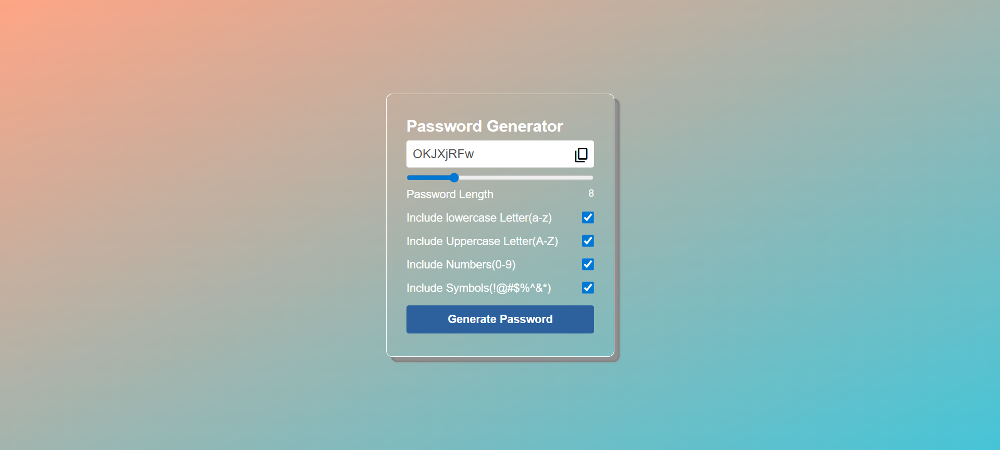

# Password Generator

A simple password generator built using HTML, CSS, and JavaScript.

## Features
- Adjustable password length with slider
- Include lowercase, uppercase, numbers, and symbols
- One-click copy to clipboard
- Responsive and modern UI

## Tech Stack
- HTML
- CSS
- JavaScript

## How to Run
Open `index.html` in your browser.

## Live Demo
[Click here to try the Password Generator](https://yourusername.github.io/password-generator/)

## Preview

